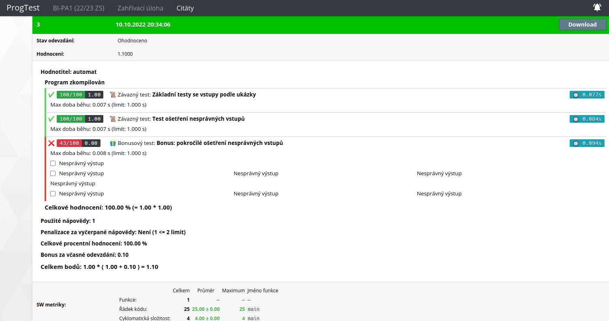

# hw00 (Warm-up Task)

The task of this homework was to make a program, that would read
an integer from user and print the respective quote.    \
Available options to ask for are numbers 1 to 9.        \

