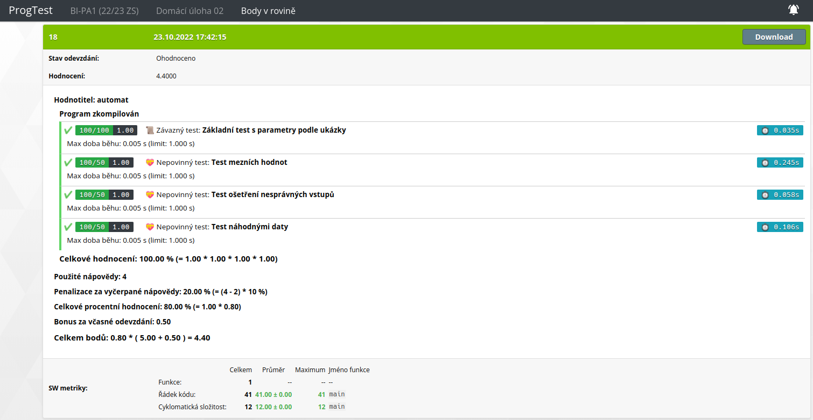

# hw02 (Points in the 2D plane)

The task was to request a user for 3 points in a plane and tell, if those
lie on the same straight line, if they don't lie on the same straight line
or if they are the same.  

