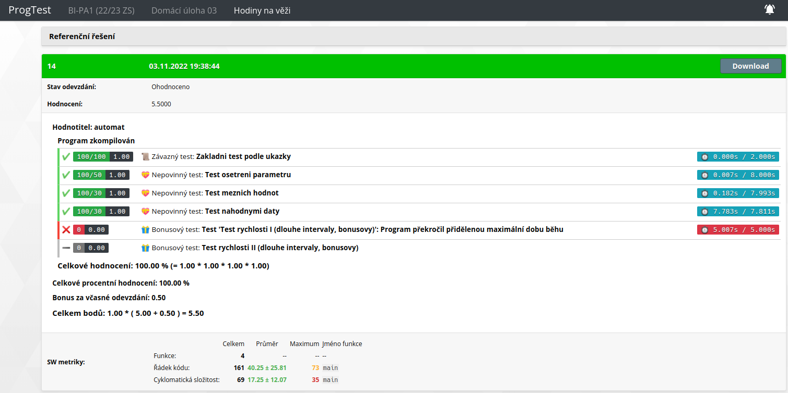

# hw03 (Clock on the tower)

The task was to implement a function "bells", which would take 2 dates
and count how many times 2 bells would strike the time:  
1. First bell strikes minutes and rings every 15 minutes in this scheme:
XX:00 - 4x, XX:15 - 1x, XX:30 - 2x a XX:45 - 3x.  
2. Second bell strikes hours and rings as many times as the hour hand shows:
00:00 - 12x, 1:00 - 1x, 2:00 - 2x, ..., 12:00 - 12x, 13:00 - 1x, 14:00 - 2x, ...  
  
Also you have to check the validity of the date. It would be invalid, if:  
a year is bigger than 1600,  
month, day, hour or minute isnt valid,  
the 2nd date is earlier than the 1st one.  

